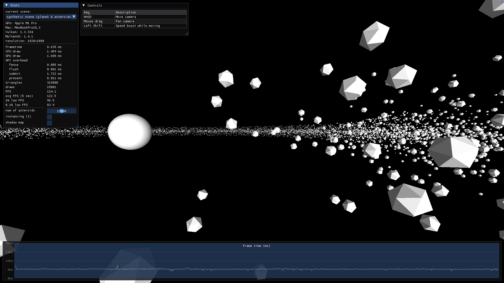
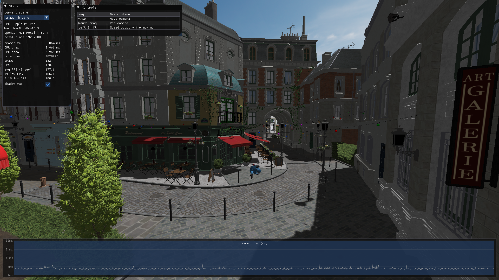

# MoltenVK vs OpenGL 4.1 API Overhead Benchmark

A simple benchmarking application to compare the CPU overhead and performance of Vulkan (via MoltenVK) and OpenGL 4.1.

It features two scenes:

- Synthetic scene (asteroid belt): CPU-bound scenario to stress test and measure raw draw call overhead using low-polygon models.
- Amazon Lumberyard Bistro: to evaluate performance in a more practical setting.

For now, the benchmark focuses on MoltenVK vs OpenGL 4.1 on macOS, but it can run on Linux and Windows. However, it won't be a fair comparison since modern AZDO techniques such as Multi-Draw Indirect or Bindless Textures in OpenGL 4.6 are not implemented in this project.

## Features

- Instancing
- Phong shading
- Shadow mapping (PCF)
- OBJ loading via Assimp
- Metrics
  - frame time
  - CPU draw time (command buffer recording)
  - GPU draw time
  - num of triangles
  - num of draw calls
  - FPS
  - 1% low FPS
  - 0.1% low FPS
  - frame time graph

Vulkan specific features:

- Bindless textures (descriptor indexing)
- Dynamic rendering
- Metrics
  - fence wait time
  - flush time
  - submit time
  - present time

### This project does NOT include the following features:

- Multi-Draw Indirect
- Bindless textures in OpenGL 4.1
- Frustum culling
- Multi-threaded command buffer recording
- MSAA

<br/>

# Benchmarks

Specs:

- Hardware: Apple M1 Pro, 8-core CPU, 14-core GPU (MacBookPro18,3)
- RAM: 16GB
- OS: macOS Sequoia 15.7.4
- MoltenVK 1.4.1 (Vulkan 1.3.334)
- OpenGL 4.1
- Resolution: 1920x1080

### Scene 1: Synthetic Scene

CPU-bound scene to stress test and measure draw call overheads using low-poly models.

FPS is averaged over 5 seconds.



#### Test 1: 15,000 icosahedrons (non-instanced)

| Metric       | OpenGL 4.1 | MoltenVK 1.4.1 |
| :----------- | :--------- | :------------- |
| frame time   | 35.46 ms   | 6.09 ms        |
| FPS          | 28.2       | 164.2          |
| 1% low FPS   | 15.1       | 155.2          |
| 0.1% low FPS | 9.5        | 152.5          |

#### Test 2: 30,000 icosahedrons (non-instanced)

| Metric       | OpenGL 4.1 | MoltenVK 1.4.1 |
| :----------- | :--------- | :------------- |
| frame time   | 69.44 ms   | 12.17 ms       |
| FPS          | 14.4       | 82.2           |
| 1% low FPS   | 13.6       | 77.6           |
| 0.1% low FPS | 12.8       | 74.6           |

#### Test 3: 15,000 icosahedrons (instanced)

| Metric       | OpenGL 4.1 | MoltenVK 1.4.1 |
| :----------- | :--------- | :------------- |
| frame time   | 3.47 ms    | 1.70 ms        |
| FPS          | 287.8      | 589.6          |
| 1% low FPS   | 234.1      | 390.0          |
| 0.1% low FPS | 222.6      | 303.9          |

#### Test 4: 30,000 icosahedrons (instanced)

| Metric       | OpenGL 4.1 | MoltenVK 1.4.1 |
| :----------- | :--------- | :------------- |
| frame time   | 5.26 ms    | 3.20 ms        |
| FPS          | 190.0      | 312.9          |
| 1% low FPS   | 137.0      | 274.2          |
| 0.1% low FPS | 100.6      | 159.1          |

### Scene 2: Amazon Lumberyard Bistro

Scene to evaluate performance in a more practical setting. 2,829,226 triangles and 132 draw calls (_aiProcess_OptimizeMeshes | aiProcess_OptimizeGraph_ via assimp).

FPS is averaged over 5 seconds.



#### Test 1: Bistro without shadow mapping

| Metric       | OpenGL 4.1 | MoltenVK 1.4.1 |
| :----------- | :--------- | :------------- |
| frame time   | 3.47 ms    | 2.24 ms        |
| FPS          | 288.1      | 447.0          |
| 1% low FPS   | 225.2      | 230.4          |
| 0.1% low FPS | 218.6      | 206.8          |

#### Test 2: Bistro with shadow mapping

| Metric       | OpenGL 4.1 | MoltenVK 1.4.1 |
| :----------- | :--------- | :------------- |
| frame time   | 5.20 ms    | 3.54 ms        |
| FPS          | 192.2      | 282.7          |
| 1% low FPS   | 153.0      | 184.3          |
| 0.1% low FPS | 140.4      | 152.3          |

<br />

## Controls

| Key        | Description              |
| ---------- | ------------------------ |
| WASD       | Move camera              |
| Mouse drag | Pan camera               |
| Left Shift | Speed boost while moving |

<br />

# Building

## Prerequisites:

First, install the dependencies based on your operating system.

#### macOS

- Install the latest Vulkan SDK from [LunarG](https://vulkan.lunarg.com/sdk/home)
- Install CMake (version 3.10 or higher)
- Install Homebrew
- Install dependencies:
  ```sh
  brew install assimp git-lfs
  git lfs install   # for obj assets
  ```
- Add the following environment variables in `~/.zshrc`:
  ```sh
  export VULKAN_SDK=/path/to/VulkanSDK/version
  export PATH="$VULKAN_SDK/bin:$PATH"
  export DYLD_LIBRARY_PATH="$VULKAN_SDK/lib:$DYLD_LIBRARY_PATH"
  ```

#### Linux (Ubuntu)

- Install dependencies:
  ```sh
  sudo apt update
  sudo apt install -y \
      git-lfs \
      build-essential \
      ninja-build \
      libassimp-dev \
      # vulkan
      vulkan-tools \
      libvulkan-dev \
      vulkan-validationlayers \
      spirv-tools \
      glslang-tools \
      libassimp-dev \
      vulkan-utility-libraries-dev
      # opengl
      libglfw3-dev \
      libgl1-mesa-dev \
      libx11-dev \
      libpthread-stubs0-dev \
      libxrandr-dev \
      libxi-dev \
  git lfs install
  ```

### General

- (Recommended) Install Visual Studio Code for development/building
- Clone this repository:
  ```sh
  # make sure you have git lfs first
  git clone https://github.com/benyoon1/vulkan-vs-opengl.git
  ```

## Build & Run

1. In VS Code, press `Cmd+Shift+P` (Mac) or `Ctrl+Shift+P` (Windows/Linux) to open the command palette.
2. Type `Tasks: Run Task` and select it.
3. Select `Vulkan: generate build files & build & run (Release)` (or `OpenGL: generate build files & build & run (Release)`) to generate build files via CMake, build, and run the executable in one step.
4. If you do not want to build with `Tasks: Run Task` in VS Code, refer to `tasks.json` to generate build files, build, and run in the terminal.

## Acknowledgements

- [LearnOpenGL](https://learnopengl.com/) for OpenGL tutorials and code references.
- [Vulkan Guide](https://vkguide.dev/) for Vulkan tutorials and code references.
